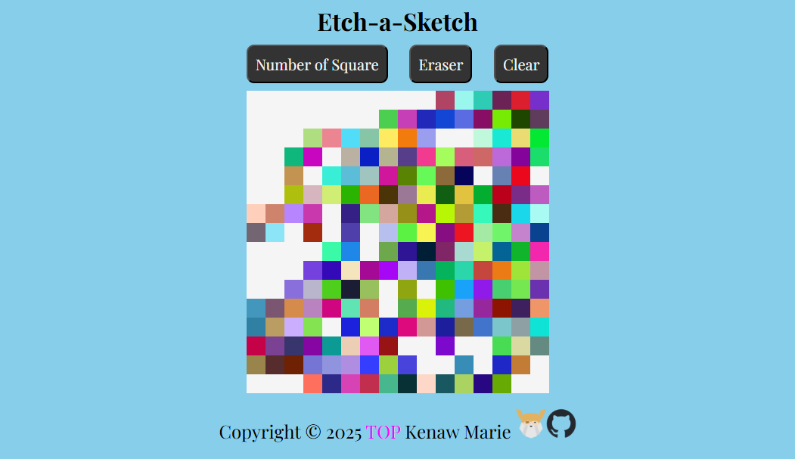

# The Odin Project(TOP) - Etch-a-Sketch

## Table of contents

  - [Overview](#overview)
  - [Screenshot](#screenshot)
  - [Links](#links)
  - [Built with](#built-with)
  - [What I learned](#what-i-learned)
  - [Continued development](#continued-development)
  - [Author](#author)
  - [Acknowledgments](#acknowledgments)

## Overview

This is a solution to the [The Odin Project: Etch-a-Sketch project](https://www.theodinproject.com/lessons/foundations-etch-a-sketch). 

### Screenshot

### Links

- Live Site URL: [Etch-a-Sketch](https://kenawmarie.github.io/Odin-Etch-a-Sketch/)

### Built with

- Semantic HTML5 markup
- CSS custom properties
- Flex box
- JS data types,functions and loops
- Document Object Model(DOM)

### What I learned

In this project i learnt how to built a web page  using css and html and make it interactive using JS. i solidified my knowledge of js specially the DOM Events and event Handler function

### Continued development

i want to focus on doing more projects to solidify my knowledge.

## Author
- Kenaw Marie
- The Odin Project - [@kenawMarie](https://www.theodinproject.com/dashboard)

## Acknowledgments

my special thanks goes to first to [The Odin Project](https://www.theodinproject.com/) and then [Free Code Camp](https://www.freecodecamp.org/).